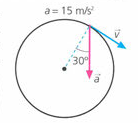

## Oxford 2015, p 234

1.  Explica qué tipo de movimiento describiría un cuerpo
    en las siguientes situaciones:
    a)  $\vec{a}_t$ es constante y $\vec{a}_c$ es cero.
    b)  $\vec{a}_c$ es constante y $\vec{a}_t$ es cero .
    e)  Ambas son 0.

1.  ¿Podría un cuerpotenervelocidadceroy, sin embargo,
    estar acelerado? Razona tu respuesta.

1.  ¿Puede cambiar el sentido de la velocidad de un
    cuerpo si su aceleración es constante?

1.  En la figura representa la aceleración
    total, en un instante determinado, de una partícula
    que describe circunferencias de 3 m de radio. Calcula,
    en ese instante la aceleración centrípeta y la aceleración tangencial.

    

    Solución: a) $a_c = 12,99$ m/s 2; $a_1 = 7,5$ m/s2

1.  Dado el vector velocidad: $\vec{v} = 3t\vec{i} + 
    4t\vec{j}$. Calcula:
    a)  La aceleración tangencial.
    b)  La aceleración normal.
    e)  El radio de curvatura.

    Solución: a) 5 m/s 2; b) 0; e) 0